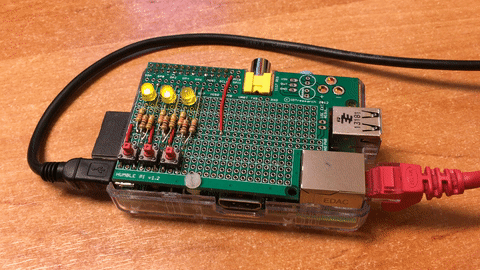

# led-swarm

This is just a test to check if multiple containers can access the GPIO.
Each container runs a little python script to drive one blinking LED.

With Docker Compose we start three containers to drive three blinking LEDs.



Adjust your GPIO pins in the `docker-compose.yml` and set the `LED_PIN` environment variable accordingly.

```
docker-compose up
```
